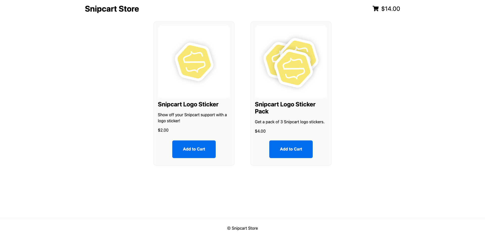
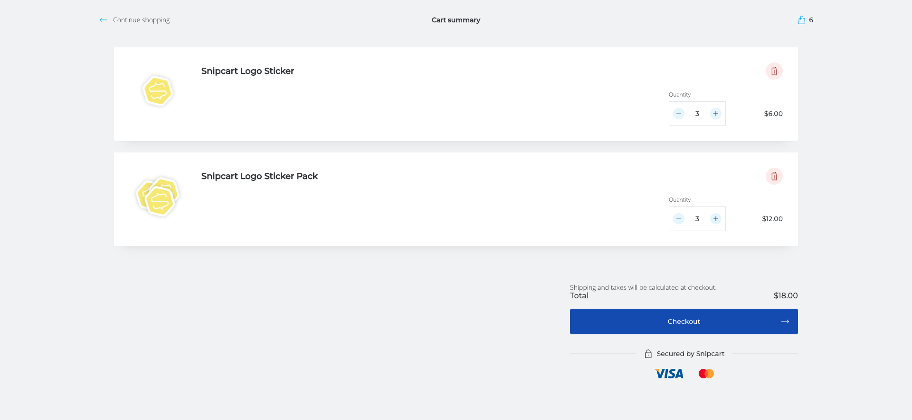
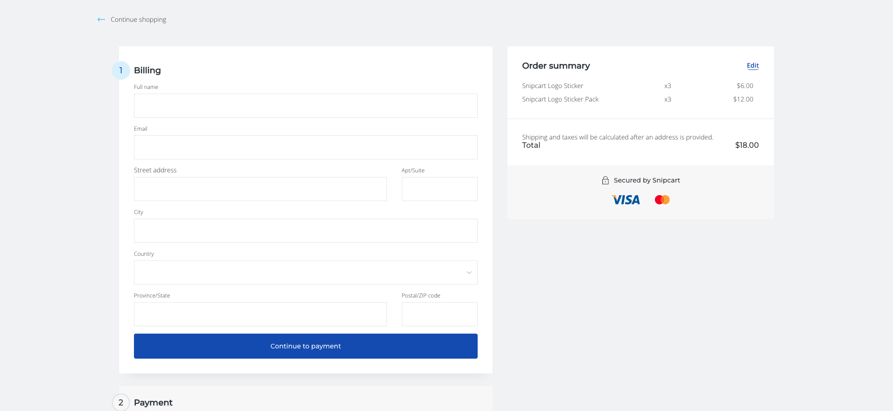
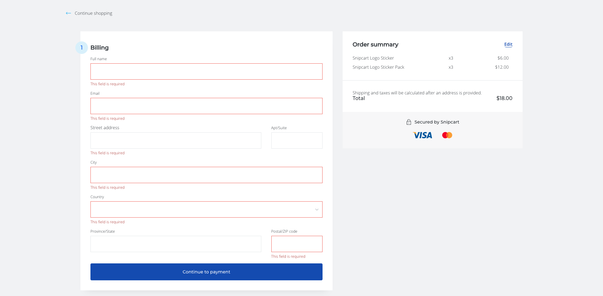

# Snipcart Store

## Table of Contents
- [Snipcart Store](#snipcart-store)
  - [Table of Contents](#table-of-contents)
  - [About](#about)
  - [Features/Tools](#featurestools)
    - [Next.js](#nextjs)
    - [Snipcart](#snipcart)
  - [Pages](#pages)
    - [Product Gallery](#product-gallery)
    - [Cart](#cart)
    - [Checkout](#checkout)

## About

A simple e-commerce site used to demonstrate integration of Snipcart with a Next.js application. Because of the simplicity of the project, the site is not deployed to any hosting services. Preview images of the site can be viewed in the README.md [Pages](#pages) section of this file.

## Features/Tools

### Next.js

> Check out the [Next.js Docs](https://nextjs.org/docs)

Next.js is a react framework used to create full-stack web applications by extending the latest React features and integrating powerful Rust-based JavaScript tooling.

### Snipcart

> Check out the [Snipcart Docs](https://snipcart.com/ecommerce-for-developers)

HTML/JavaScript shopping cart platform used to add custom e-commerce to sites/applications. RESTful API, JS API, and webhooks. 

## Pages 

To keep the application simple the app only contains a main page displaying products, a cart page ("modal"-like component that slides over the page), and a checkout page that features a multi-step form.

### Product Gallery

The product gallery displays all available products. Products are dynamically displayed. Data provided with a JSON file.

### Cart 

Adding an item or clicking on the cart icon triggers the cart modal. The cart displays items added for purchase, the item quantity, dollar amount per item, and the total amount of all items. 

### Checkout 

The checkout page integrates snipcart e-commerce API. 

The checkout page uses built-in form validation. The image below is screenshot of the **Billing** form step displaying errors for missing information - preventing the user from proceeding to the next step (**Shipping**).
